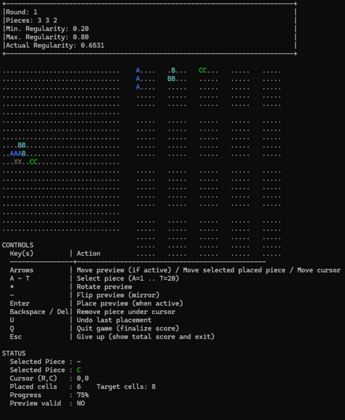

# Squares Puzzle Game

This project is a **one-player puzzle game** developed for the **CME1251 course (Fall 2025–2026)**.

The goal of the game is to generate puzzle shapes using randomly created pieces and challenge the player to reconstruct the puzzle using those pieces. The player earns points by correctly completing the puzzle shapes.

The project focuses on **algorithm design, shape generation, piece transformations, and puzzle construction**.

---

# Features

- Random **piece generation**
- Piece normalization and shifting
- Piece **rotation and reversing**
- Detection of **duplicate pieces**
- Generation of **all possible piece orientations**
- Random puzzle creation
- Puzzle **regularity calculation**
- Interactive puzzle solving
- Score calculation based on puzzle difficulty

---

# Game Mechanics

The game consists of several stages:

### 1. Generating Pieces
Pieces are generated inside a **5×5 grid**.  
Each piece consists of **2–12 connected squares**.

Squares must be connected **via edges (up, down, left, right)**.  
Diagonal connections are not allowed. :contentReference[oaicite:1]{index=1}

After generation, pieces are **normalized** by shifting them to the leftmost position.

---

### 2. Comparing Pieces

Generated pieces must be **unique**.

To detect duplicates, pieces are compared after:

- Rotating
- Reversing
- Normalizing

All possible orientations of each piece are generated and compared with existing pieces.

---

### 3. Forming a Puzzle

The puzzle is generated in a **20×30 grid**.

Constraints:

- Maximum **20 pieces**
- Maximum **160 squares**

Pieces are randomly rotated, reversed, and placed in random positions to construct the puzzle.

A **regularity metric** determines how compact the puzzle is.

Regularity = TotalNumberOfSquares / ((TotalLengthOfPerimeter / 4)^2)

Example:
9 / (5^2) = 0.36

The puzzle must satisfy the **minimum and maximum regularity values** defined by the player. :contentReference[oaicite:2]{index=2}

---

# Game Flow

1. The player selects:
   - Piece sizes
   - Regularity interval
2. The computer generates a puzzle.
3. Puzzle symbols are converted to **X characters**.
4. The player reconstructs the puzzle using generated pieces.
5. If the puzzle is completed correctly, the player earns points and moves to the next round.
6. If the puzzle cannot be completed, the game ends.

---

# Scoring System

The score for each round is calculated using the following formula:

RoundScore = TotalNumberOfSquares × (4 × Regularity)^4


Higher regularity and larger puzzles result in higher scores. :contentReference[oaicite:3]{index=3}

---

# Technologies Used

- C# Programming Language
- Algorithm Design
- Puzzle Generation Algorithms

---

# Example Gameplay

Below is an example puzzle generated by the system.



---
# How to Run the Project

1. Clone the repository

```bash
git clone https://github.com/edakirci/SquaresGame.git
```
2. Open the project in Visual Studio
3. Make sure the required .NET version is installed.
4. Build the project

Build → Build Solution
5. Run the project

Debug → Start Without Debugging
---

# Course Information

**Course:** CME1251 - Project Based Learning II  

**Semester:** Fall 2025–2026  

---


